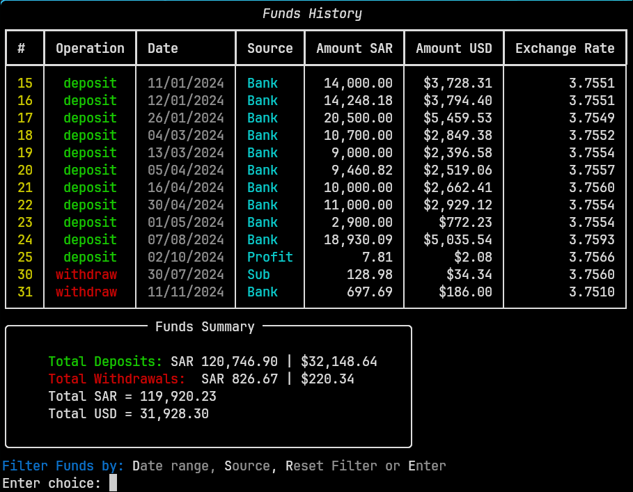

# TraderCLI

A command-line interface (CLI) application for managing and tracking stock trades, funds, and portfolio positions with multiple accounts. Built with Python and SQLite, featuring a rich terminal UI powered by the [Rich](https://github.com/Textualize/rich) library.




## Features

### Portfolio Management
- **View Holdings Summary**: Display all your stock positions with shares, total cost, market value, and unrealized/realized P/L
- **Open Positions Tracking**: Track all open buy positions with real-time profit/loss calculations
- **Account Totals**: View total funds, cash balance, fees, VAT, and net worth at a glance

### Trade Operations
- **Buy Trades**: Record stock purchases with automatic cost calculation (including fees and VAT)
- **Sell Trades**: Record stock sales with profit/loss tracking and position closing
- **Delete Trades**: Remove incorrect trade entries
- **View Trade Details**: Inspect individual trade records in a formatted table

### Funds Management
- **Deposit Funds**: Record fund deposits with multi-currency support (USD and configurable secondary currency)
- **Withdraw Funds**: Record fund withdrawals
- **Funds History**: View complete deposit/withdrawal history

### 🔧 Additional Tools
- **Real-Time Price Updates**: Fetch current stock prices from Yahoo Finance (yfinance)
- **Trade Filtering**: Filter and search through trade history
- **Risk Management Planner**: Plan risk scenarios with technical levels and drawdown calculations
- **Calculator**: Built-in percentage and currency conversion calculator

### Multi-Account Support
- Create and manage multiple trading accounts
- Each account has its own database, exchange rate, and default ticker settings
- Easy switching between accounts

### Import Existing Data from Excel
Import your existing trades and funds from Excel spreadsheets with two methods:

**Method 1: Using Markers (Automated)**
Add markers in your Excel file to define data sections. The app will automatically detect and import:

| Marker Start | Marker End | Data Type |
|--------------|------------|-----------|
| `#FDB` | `#FDE` | Fund Deposits |
| `#FWB` | `#FWE` | Fund Withdrawals |
| `#TBB` | `#TBE` | Buy Trades |
| `#TSB` | `#TSE` | Sell Trades |

**Method 2: Manual Row Selection**
Specify row numbers or ranges (e.g., `1-5, 7, 10-12`) to import specific rows.

**Excel Column Mapping:**

For Funds (deposits/withdrawals):
| Column | Field |
|--------|-------|
| C (3) | Date |
| D (4) | Source |
| E (5) | Amount (Secondary Currency) |
| F (6) | Amount (USD) |
| G (7) | Exchange Rate |

For Trades (buy/sell):
| Column | Field |
|--------|-------|
| A (1) | Is Position Open (buy only) |
| C (3) | Trade Date |
| D (4) | Symbol |
| E (5) | Quantity |
| F (6) | Price |
| G (7) | Fees |
| H (8) | VAT |
| J (10) | Cost Value |
| K (11) | Profit/Loss (sell only) |

To load data: Press `M` → `L` and follow the prompts. Default file: `stocks_transactions.xlsx`

## Installation

### Prerequisites
- Python 3.13 or higher
- pip or Poetry package manager

### Using Poetry (Recommended)

1. Clone the repository:
   ```bash
   git clone <repository-url>
   cd tradercli
   ```

2. Install dependencies using Poetry:
   ```bash
   pip install poetry
   poetry install
   ```

3. Run the application:
   ```bash
   poetry run python src/main.py
   ```

### Using pip

1. Clone the repository:
   ```bash
   git clone <repository-url>
   cd tradercli
   ```

2. Create a virtual environment (optional but recommended):
   ```bash
   python -m venv venv
   source venv/bin/activate  # On Windows: venv\Scripts\activate
   ```

3. Install dependencies:
   ```bash
   pip install pandas openpyxl rich "yfinance>=0.2.66,<0.3.0"
   ```

4. Run the application:
   ```bash
   python src/main.py
   ```

### Building Executable (Optional)

To create a standalone executable using PyInstaller:

```bash
poetry run pyinstaller main.spec
```

The executable will be available in the `dist/` folder.

## Usage

### Main Interface

When you start the application, you'll see:
- **Trades for Open Positions**: Table showing all your open buy positions
- **Summary of Holdings**: Overview of your portfolio by ticker
- **Account Totals**: Financial summary including funds, cash, fees, and net worth

### Navigation

From the main screen, use these single-letter commands:

| Key | Action |
|-----|--------|
| `B` | Record a Buy trade |
| `S` | Record a Sell trade |
| `D` | Delete a trade |
| `T` | Change selected ticker |
| `U` | Update prices from Yahoo Finance |
| `F` | Filter trades |
| `P` | Risk management planner |
| `C` | Open calculator |
| `M` | Access main menu (accounts, settings, data management) |
| `Q` | Quit application |

You can also enter a price directly to update the selected ticker's current price.

### Main Menu Options

Press `M` to access additional options:

| Key | Action |
|-----|--------|
| `A` | Switch or create accounts |
| `R` | Reset/migrate database schema |
| `L` | Load data from external files |
| `F` | View funds history |
| `D` | Record a deposit |
| `W` | Record a withdrawal |
| `P` | Edit position settings |
| `S` | Modify account settings |

### Configuration

The application uses a `settings.json` file to store:
- Default account name
- Multiple account configurations with:
  - Exchange rate and currency label (e.g., SAR, EUR)
  - Default selected ticker
  - Trading fees (USD)

## Database Schema

TraderCLI uses SQLite databases with the following tables:

### FUNDS Table
Tracks all deposits and withdrawals:
- `ID`: Auto-increment primary key
- `opr`: Operation type ('deposit' or 'withdraw')
- `fund_date`: Date of the transaction
- `source`: Source/destination of funds
- `amount_SAR`: Amount in secondary currency
- `amount_USD`: Amount in USD
- `rate_exchange`: Exchange rate used

### TRADES Table
Records all buy and sell trades:
- `ID`: Auto-increment primary key
- `trade_date`: Date of the trade
- `symbol`: Stock ticker symbol
- `opr`: Operation type ('buy' or 'sell')
- `filled_qty`: Number of shares
- `price`: Price per share
- `fees`: Trading fees
- `vat`: Value Added Tax
- `cost_value`: Total cost/value of the trade
- `profit_loss`: Realized profit/loss (for sells)
- `is_position_open`: Whether the position is still open

## Dependencies

- **pandas**: Data manipulation and analysis
- **openpyxl**: Excel file reading/writing
- **rich**: Terminal formatting and tables
- **yfinance**: Yahoo Finance API for real-time stock prices

## Development

### Dev Dependencies
- **pyinstaller**: For building standalone executables

### Project Structure
```
tradercli/
├── src/
│   ├── main.py          # Application entry point
│   ├── trade.py         # Trade operations (buy, sell, delete, view)
│   ├── menu.py          # Main menu and funds management
│   ├── planner.py       # Risk management planner
│   ├── calculator.py    # Calculator utilities
│   ├── filter_trades.py # Trade filtering
│   ├── load_data.py     # Data import functionality
│   ├── migrate.py       # Database migration
│   ├── settings.py      # Settings management
│   ├── stocks_reader.py # Stock data reader
│   └── utils.py         # Utility functions
├── build/               # PyInstaller build files
├── pyproject.toml       # Project configuration
├── schema.sql           # Database schema
├── settings.json        # Application settings
└── README.md            # This file
```

## License

This project is provided as-is for personal use.

## Author

Developed by bugyboo (yasser.harbi@gmail.com)
